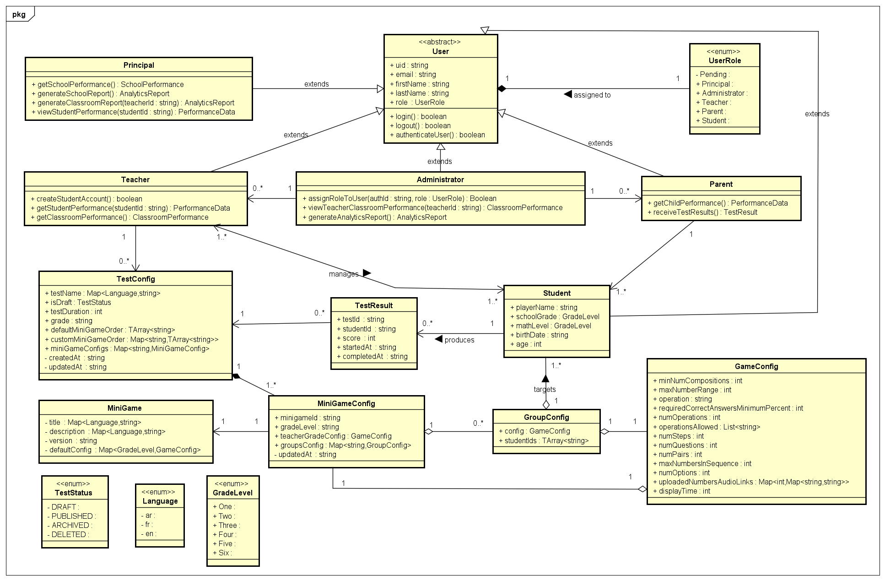

# Math-Web

This web app provides dashboards for teachers, administrators, and parents to monitor student performance and manage math assessment tests within the Mathoria game. It allows educators to register students, track progress, and adjust assessment tasks for an enhanced learning experience.

## 🚀 Features

- **Student Registration:** Teachers can register students for Mathoria’s math assessment tests.
- **Real-Time Sync:** Seamlessly integrates with Mathoria's Firebase Realtime Database for live updates.
- **Performance Monitoring:** Enables tracking of student progress, scores, and performance reports.
- **Role-Based Access:** Custom dashboards for principals, administrators, teachers, and parents, with Firebase Authentication.
- **User Role Management:** Principals can assign roles, and administrators can assign teacher or parent roles to users.
- **Cheat Prevention:** Students can only take the math test in the game if registered by an eligible teacher.
- **Classroom Insights (Administrators and Principals):** View school and classroom performance averages and indicators, with drill-down options for detailed student insights.
- **Parental Access:** Parents can track their child's academic progress and performance.
- **Adaptive Quests:** Teachers can adjust assessment tasks based on each student’s performance and learning progress.

## 📦 Tech Stack

- **Frontend:** Angular (primary), with a sample React project for reference.
- **Backend:** Firebase Realtime Database & Firebase Authentication.

## ⚙️ How It Works

1. **User Authentication:** Users create an account through Firebase authentication. Principals can assign any role, and administrators can assign teacher and parent roles.
2. **Student Registration:** Teachers register students by entering the student's Mathoria player name.
3. **Profile Sync:** Student profiles sync with Mathoria, enabling test access.
4. **Monitoring:** Principals, administrators, teachers, and parents can view tailored performance data and analytics based on their assigned roles.
5. **Automatic User IDs:** The `Principal`, `Teacher`, `Parent`, `Administrator`, and `Student` classes inherit the `uid` field from the parent abstract Firebase class `User`. This ensures that each user is uniquely identified.

## 🔑 Registration Flow

1. **Search Student:** Enter the player's Mathoria name (e.g., `player_name`).
2. **Register Details:** Fill in the student's first name, last name, birthday, grade, gender, and photo.
3. **Sync:** Once registered, the student is eligible for tests (fields `is_authenticated_by_teacher = true` and `linked_teacher_id` are updated).

## 🔒 Rules & Policies

- Only students registered by an eligible teacher can take the test.
- Students leaving the game multiple times during a test may automatically fail. If they are disconnected, they will receive a warning, and if disconnected again, the test is considered incomplete.
- Photo URL is used for unique identification (via face recognition).
- User roles (principal, teacher, parent, admin) are linked to their corresponding `uid` from Firebase Authentication.

## 🧑‍💻 Class Diagram

The **Math-Web** app is designed with a clear class structure to manage user roles, student registrations, and data synchronization. Below is the class diagram representing the core components and their relationships:



### Key Classes:
- **User (Abstract Class):** All user roles (Principal, Teacher, Parent, Administrator, Student) inherit from this class, which includes the `uid` field for unique identification and methods for authentication.
- **UserRole:** An enumeration class to define the users possible roles which are `Principal`, `Teacher`, `Parent`, `Administrator`, and `Student`.
- **Principal:** Can assign roles to other users (administrators, teachers and parents or even students) and has access to school-wide performance data.
- **Teacher:** Responsible for registering users (players in Mathoria's game) as students and adjusting assessment tasks, ensuring that only registered players as students can take the test in the game.
- **Administrator:** Has access to performance data at both the classroom and school levels, and can assign teacher and parent roles to users.
- **Parent:** Can monitor their child's academic progress and performance.
- **Student:** Represents the students registered to take the Mathoria math assessment tests, with personalized profiles synced with the Mathoria game.

For a detailed explanation of the class structure, please refer to the diagram above.

---

Make sure to replace the `"path/to/your/class-diagram.png"` with the actual path where your diagram image is stored.

## 🗂 Sample Project

Check out the sample React project here: [Math Dashboard React](https://github.com/najlae01/math-dashboard-react)

## 📥 Installation

1. Clone the repository:
   ```bash
   git clone https://github.com/najlae01/math-web.git
   ```
2. Install dependencies:
   ```bash
   npm install
   ```
3. Run the app:
   ```bash
   ng serve
   ```

## 🤝 Contributing

1. Fork the repository.
2. Create a new branch (`git checkout -b group-one`).
3. Commit changes (`git commit -m 'Add the group number one'`).
4. Push to the branch (`git push origin group-one`).
5. Open a pull request.

## 📧 Contact

For support, contact [Najlae](mailto:najlae.abarghache@etu.uae.ac.ma).
